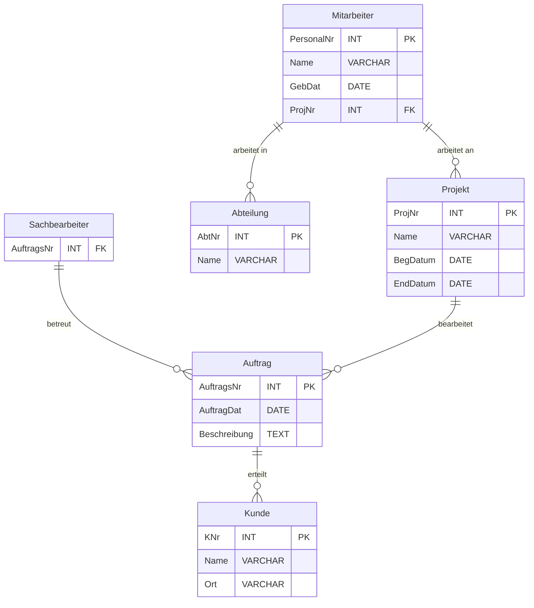

#### **1. Anforderungsanalyse**
- **Definition**: Klärung der Anforderungen des Kunden für ein Softwaresystem, inkl. Datenbankaspekte.
- **Phasen im klassischen Wasserfallmodell**:
  1. **Anforderungsanalyse**: Definition von Aufgaben, Randbedingungen (Hardware, Interoperabilität, etc.).
  2. **Design**: Aufteilung in Teilsysteme, Wahl der technischen Mittel (z. B. Datenbanken).
  3. **Implementierung**: Programmierung.
  4. **Test**: Prüfung mit Testfällen.
  5. **Abnahme**: Kundenvorführung.

#### **2. Anforderungsanalyse für Datenbanken**
- **Ziele**:
  - Bestimmung der benötigten Daten für die Prozesse.
  - Modellierung einer "Miniwelt" der relevanten Daten und Beziehungen.
- **Fokus**: 
  - Abbildung von Objekten der realen Welt (Entitäten) und deren Beziehungen in einem Modell.

---

### **3. Grundbegriffe**
1. **Entität**: Ein eindeutiges, individuelles Objekt (z. B. Kunde Meier).
2. **Attribut**: Eigenschaft einer Entität, bestehend aus Namen und Datentyp (z. B. Kundennummer).
3. **Entitätstyp**: Gruppe von Entitäten mit gleichen Eigenschaften (z. B. Entitätstyp Kunde).
4. **Beziehung (Assoziation)**: Verbindung zwischen Entitäten, kann ebenfalls Attribute haben (z. B. Kunde tätigt Bestellung).

---

### **4. Entity-Relationship-Modell (ERM)**
- **Definition**:
  - Visuelle Darstellung von Entitätstypen, deren Attributen und Beziehungen.
- **Kardinalitäten**:
  - Geben an, wie viele Entitäten miteinander in Beziehung stehen können:
    - **1:1**: Eine Entität ist mit genau einer anderen Entität verbunden.
    - **1:N**: Eine Entität ist mit mehreren anderen verbunden.
    - **M:N**: Mehrere Entitäten stehen in Beziehung zu mehreren anderen.

#### **Beispiele für Kardinalitäten**:
- **1:1-Beziehung**:
  - Ehemann – verheiratet – Ehefrau.
- **1:N-Beziehung**:
  - Mutter – geboren – Kind.
- **M:N-Beziehung**:
  - Student – belegt – Vorlesung.

---

### **5. Modellierungskomplexitäten**
1. **Zyklen**:
   - Vermeidung von Redundanzen, jede Information sollte nur einmal dargestellt werden.
   - Beispiel:
     - "Kunde kauft Artikel" → sinnvoll als eigenständige Beziehung.

2. **Aufteilung von M:N-Beziehungen**:
   - Ersetzen durch eine zusätzliche Entität mit zwei 1:N-Beziehungen.
   - Beispiel: Bestellung → enthält → Artikel.

3. **Rekursive Beziehungen**:
   - Eine Beziehung innerhalb eines Entitätstyps.
   - Beispiele:
     - **Symmetrisch**: Mitarbeiter – ist Kollegen von – Mitarbeiter.
     - **Nicht symmetrisch**: Mitarbeiter – berichtet an – Vorgesetzter.

4. **Existenzabhängige Entitäten**:
   - Eine Entität existiert nur in Verbindung mit einer anderen.
   - Beispiel: Raum existiert nur, wenn das Gebäude existiert.

5. **"Is-a"-Beziehungen**:
   - Vererbung in der Modellierung.
   - Beispiel: Angestellter **is-a** Sachbearbeiter oder Mitarbeiter.

---

### **6. Modellierungsregeln**
- **Entitäten vs. Attribute**:
  - Häufig gleiche Werte → eigenes Entitätstyp (z. B. Artikelgruppe: "Spielwaren").
  - Mehrere Werte → Umwandlung in Entitätstyp (z. B. Adresse: Straße, Hausnummer, Ort).
- **Entitätstyp oder mehrere Attribute**:
  - Beispiel: Adresse als einzelne oder mehrere Attribute abhängig vom Zugriffszweck (z. B. PLZ für Filter).

---

### **7. Übungen**
- **Beispielaufgabe: Unternehmensmodellierung**:
  - **Entitäten**: Mitarbeiter, Sachbearbeiter, Kunde, Abteilung, Auftrag, Projekt.
  - **Beziehungen**:
    - Mitarbeiter → arbeitet in → Abteilung.
    - Sachbearbeiter → betreut → Kunde.
    - Kunde → erteilt → Auftrag.
    - Projekt → bearbeitet → Auftrag.
    - Mitarbeiter → arbeitet an → Projekt.

**ERM-Modell**:

---

