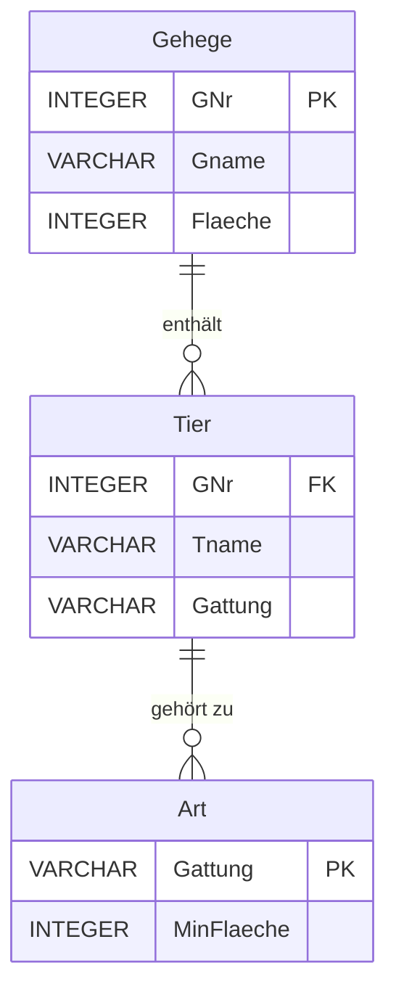

#### **Einfache SQL-Abfragen**
1. **Grundlegende Abfragen:**
   - Spalten auswählen:
     ```sql
     SELECT Gname FROM Gehege;
     ```
   - Doppelte Werte eliminieren:
     ```sql
     SELECT DISTINCT Gattung FROM Tier;
     ```

2. **Berechnete Spalten:**
   - Berechnung von Anteilen:
     ```sql
     SELECT Gname, (Flaeche / 50.0) * 100.0 AS Anteil FROM Gehege;
     ```

3. **Sortierung der Ausgabe:**
   - Nach Größe aufsteigend:
     ```sql
     SELECT Gname, Flaeche FROM Gehege ORDER BY Flaeche ASC;
     ```

---

#### **WHERE-Bedingungen und Muster**
1. **Filter mit Bedingungen:**
   - Ausgabe aller Schafe:
     ```sql
     SELECT Tname FROM Tier WHERE Gattung = 'Schaf';
     ```

2. **Vergleichsmuster (LIKE):**
   - Namen, die ein "a" enthalten:
     ```sql
     SELECT Tname FROM Tier WHERE Tname LIKE '%a%';
     ```
   - Namen mit "n" an dritter Stelle:
     ```sql
     SELECT Tname FROM Tier WHERE Tname LIKE '__n%';
     ```

---

#### **Aggregatsfunktionen**
1. **Zusammenfassungen:**
   - Maximale Fläche:
     ```sql
     SELECT MAX(Flaeche) AS MaxFlaeche FROM Gehege;
     ```
   - Gesamtanzahl der Tiere:
     ```sql
     SELECT COUNT(*) AS Tieranzahl FROM Tier;
     ```
   - Durchschnittsfläche:
     ```sql
     SELECT AVG(Flaeche) AS Durchschnitt FROM Gehege;
     ```

2. **Null-Werte ignorieren:**
   - Durchschnitt berechnen:
     ```sql
     SELECT AVG(Gehalt) FROM Gehaelter WHERE Gehalt IS NOT NULL;
     ```

---

#### **Verknüpfungen zwischen Tabellen**
1. **Einfache Joins:**
   - Tiere und ihre Gehege:
     ```sql
     SELECT Tier.Tname, Gehege.Gname
     FROM Tier
     JOIN Gehege ON Tier.GNr = Gehege.GNr;
     ```

2. **Komplexe Bedingungen:**
   - Tiere mit Flächenbedarf <= 6:
     ```sql
     SELECT DISTINCT Gehege.Gname, Art.Gattung
     FROM Gehege
     JOIN Tier ON Gehege.GNr = Tier.GNr
     JOIN Art ON Tier.Gattung = Art.Gattung
     WHERE Art.MinFlaeche <= 6;
     ```

---

#### **Umbenennung und Selbstverknüpfung**
1. **Alias für Tabellen und Spalten:**
   - Umbenennung für bessere Lesbarkeit:
     ```sql
     SELECT Gehege.Gname AS Gebiet, Tier.Tname AS Tiername
     FROM Gehege, Tier
     WHERE Gehege.GNr = Tier.GNr;
     ```

2. **Selbstverknüpfung:**
   - Gehege mit verschiedenen Gattungen:
     ```sql
     SELECT DISTINCT T1.GNr
     FROM Tier T1, Tier T2
     WHERE T1.GNr = T2.GNr AND T1.Gattung <> T2.Gattung;
     ```

---

#### **Schritte für SQL-Anfragen**
1. **Tabellen auswählen:** Notiere alle Tabellen in der `FROM`-Zeile.
2. **Verknüpfungen definieren:** Verknüpfe Tabellen über `WHERE`.
3. **Filter anwenden:** Füge zusätzliche Bedingungen hinzu.
4. **Spalten auswählen:** Bestimme die relevanten Informationen in der `SELECT`-Zeile.
5. **Sortierung hinzufügen (optional):** Definiere die Reihenfolge in der `ORDER BY`-Zeile.

---

### **Mermaid-Darstellung von Beziehungen**




---
