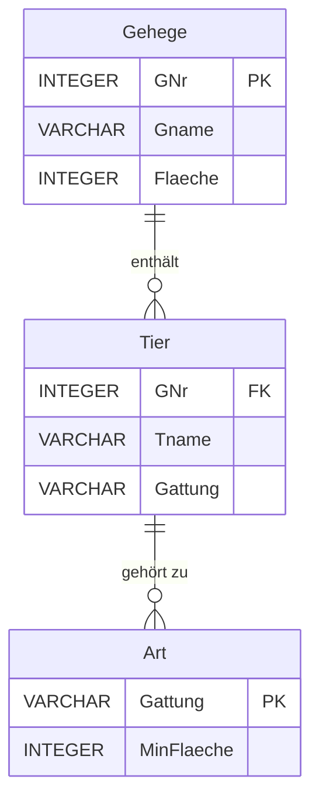

#### **Gruppierung mit `GROUP BY`**
1. **Ziel:**
   - Aggregationen auf Gruppen statt auf gesamte Tabellen anwenden.
   
2. **Beispiel: Anzahl der Tiere je Gattung**
   ```sql
   SELECT Gattung, COUNT(*) AS Tieranzahl
   FROM Tier
   GROUP BY Gattung;
   ```

   **Ablauf:**
   - Tabelle wird nach `Gattung` gruppiert.
   - Innerhalb jeder Gruppe wird die Anzahl der Tiere gezählt.

3. **Beispiel: Anzahl der Tiere je Gattung in einem Gehege**
   ```sql
   SELECT GNr, Gattung, COUNT(*) AS Tieranzahl
   FROM Tier
   GROUP BY GNr, Gattung;
   ```

---

#### **Gruppierung mit `NULL`-Werten**
- `NULL`-Werte in Gruppierungen werden als eigene Gruppe behandelt.
- **Beispiel: Gruppierung mit `NULL`-Werten**
   ```sql
   SELECT Artikel, Anzahl, COUNT(*)
   FROM Abrechnungsfragment
   GROUP BY Artikel, Anzahl;
   ```

---

#### **Filtern von Gruppen mit `HAVING`**
1. **Unterschied zu `WHERE`:**
   - `WHERE` filtert Zeilen vor der Gruppierung.
   - `HAVING` filtert Gruppen nach der Aggregation.

2. **Beispiel: Gehege mit mindestens 3 Tieren**
   ```sql
   SELECT GNr
   FROM Tier
   GROUP BY GNr
   HAVING COUNT(*) >= 3;
   ```

3. **Beispiel: Gattungen mit höchstens 3 Tieren (außer Schafe)**
   ```sql
   SELECT Gattung, COUNT(*) AS Tieranzahl
   FROM Tier
   GROUP BY Gattung
   HAVING Gattung <> 'Schaf' AND COUNT(*) <= 3;
   ```

---

#### **Kombination von Tabellen und Gruppierungen**
1. **Beispiel: Fläche pro Gehege, die von Tieren verbraucht wird**
   ```sql
   SELECT Gehege.Gname, SUM(Art.MinFlaeche) AS Verbraucht
   FROM Gehege
   JOIN Tier ON Gehege.GNr = Tier.GNr
   JOIN Art ON Tier.Gattung = Art.Gattung
   GROUP BY Gehege.Gname;
   ```

2. **Beispiel: Flächenbedarf einer Gattung mit mindestens 3 Tieren**
   ```sql
   SELECT Gattung, SUM(Art.MinFlaeche) AS Bedarf
   FROM Tier
   JOIN Art ON Tier.Gattung = Art.Gattung
   GROUP BY Gattung
   HAVING COUNT(*) >= 3;
   ```

---

#### **Schritte zur Formulierung von SQL-Abfragen mit Gruppierungen**
1. **Tabellen auswählen:**
   - Schreibe die benötigten Tabellen in die `FROM`-Zeile.
2. **Verknüpfungen definieren:**
   - Verknüpfe Tabellen über Fremdschlüssel in der `WHERE`-Zeile.
3. **Filtern vor der Gruppierung:**
   - Nutze `WHERE`, um irrelevante Zeilen auszuschließen.
4. **Gruppierung:**
   - Gib die Gruppierungsattribute in der `GROUP BY`-Zeile an.
5. **Filtern nach der Gruppierung:**
   - Nutze `HAVING`, um Gruppen auszuschließen.
6. **Auswahl der Ergebnisse:**
   - Gib relevante Attribute und Aggregationen in der `SELECT`-Zeile an.
7. **Sortierung der Ergebnisse:**
   - Nutze `ORDER BY`, um die Ausgabe zu ordnen.

---

### **Mermaid-Diagramm: Abfrage mit Gruppierung und Verknüpfungen**




---
