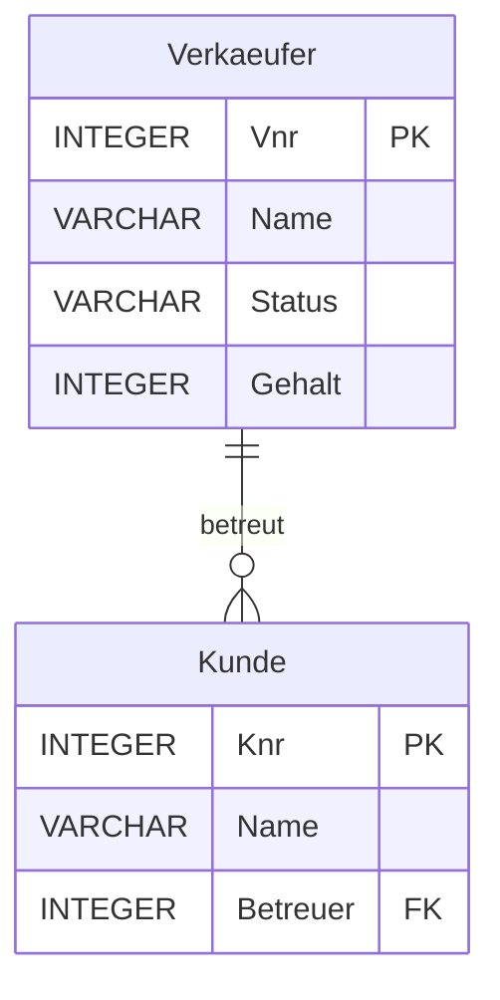

#### **Was ist SQL?**
- **SQL (Structured Query Language)**: Standardisierte Sprache zur Arbeit mit Datenbanken.
- Drei Hauptkomponenten:
  1. **DDL (Data Definition Language)**: Definition von Tabellen und Strukturen.
  2. **DML (Data Manipulation Language)**: Abfragen, Einfügen, Ändern und Löschen von Daten.
  3. **DCL (Data Control Language)**: Rechteverwaltung und Zugriffskontrolle.

---

### **Tabellendefinition**
- **Beispiel für Tabellenstruktur:**
```sql
CREATE TABLE Verkaeufer (
  Vnr INTEGER PRIMARY KEY,
  Name VARCHAR(6),
  Status VARCHAR(7) DEFAULT 'Junior',
  Gehalt INTEGER
);
```

- **Fremdschlüsselbeziehung:**
```sql
CREATE TABLE Kunde (
  Knr INTEGER PRIMARY KEY,
  Name VARCHAR(6),
  Betreuer INTEGER,
  CONSTRAINT FK_Kunde 
  FOREIGN KEY (Betreuer) 
  REFERENCES Verkaeufer(Vnr)
);
```

---

### **Operationen auf Tabellen**

1. **Daten einfügen:**
   - Mit vollständigen Werten:
     ```sql
     INSERT INTO Verkaeufer VALUES (1001, 'Udo', 'Junior', 1500);
     ```
   - Mit spezifischen Spalten:
     ```sql
     INSERT INTO Verkaeufer (Vnr, Name) VALUES (1002, 'Ute');
     ```

2. **Daten ändern:**
   ```sql
   UPDATE Verkaeufer SET Gehalt = Gehalt * 1.05 WHERE Status = 'Junior';
   ```

3. **Daten löschen:**
   ```sql
   DELETE FROM Verkaeufer WHERE Vnr = 1001;
   ```

---

### **Constraints**
- **Primärschlüssel:** `PRIMARY KEY`
- **Fremdschlüssel:** `FOREIGN KEY` mit `ON DELETE CASCADE` (für verknüpfte Löschungen).
- **NOT NULL:** Spalte darf keinen NULL-Wert enthalten.
- **UNIQUE:** Eindeutigkeit der Spaltenwerte.
- **CHECK:** Zusätzliche Bedingungen, z. B.:
  ```sql
  CHECK (Gehalt <= 2000 OR Status <> 'Junior');
  ```

---

### **SQL-Abfragen (SELECT)**
- **Alle Spalten einer Tabelle:**
  ```sql
  SELECT * FROM Verkaeufer;
  ```
- **Gefilterte Abfrage mit Bedingungen:**
  ```sql
  SELECT Name, Gehalt FROM Verkaeufer WHERE Status = 'Senior';
  ```
- **Verknüpfung mehrerer Tabellen (Join):**
  ```sql
  SELECT Kunde.Name, Verkaeufer.Name
  FROM Kunde
  JOIN Verkaeufer ON Kunde.Betreuer = Verkaeufer.Vnr;
  ```

---

### **Mermaid-Visualisierung:**




---

