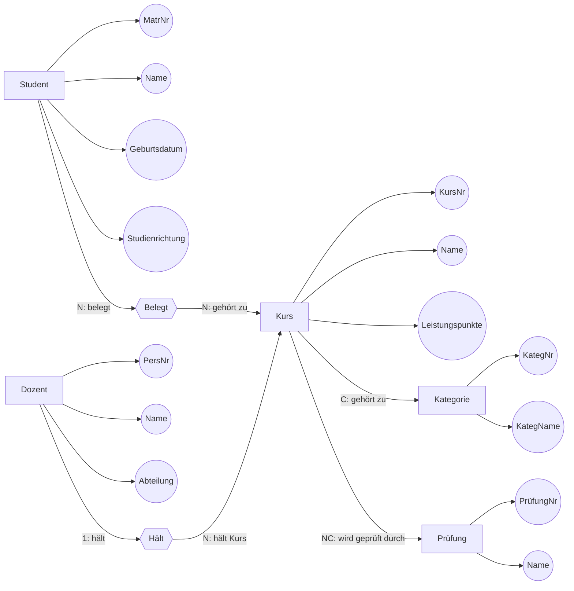
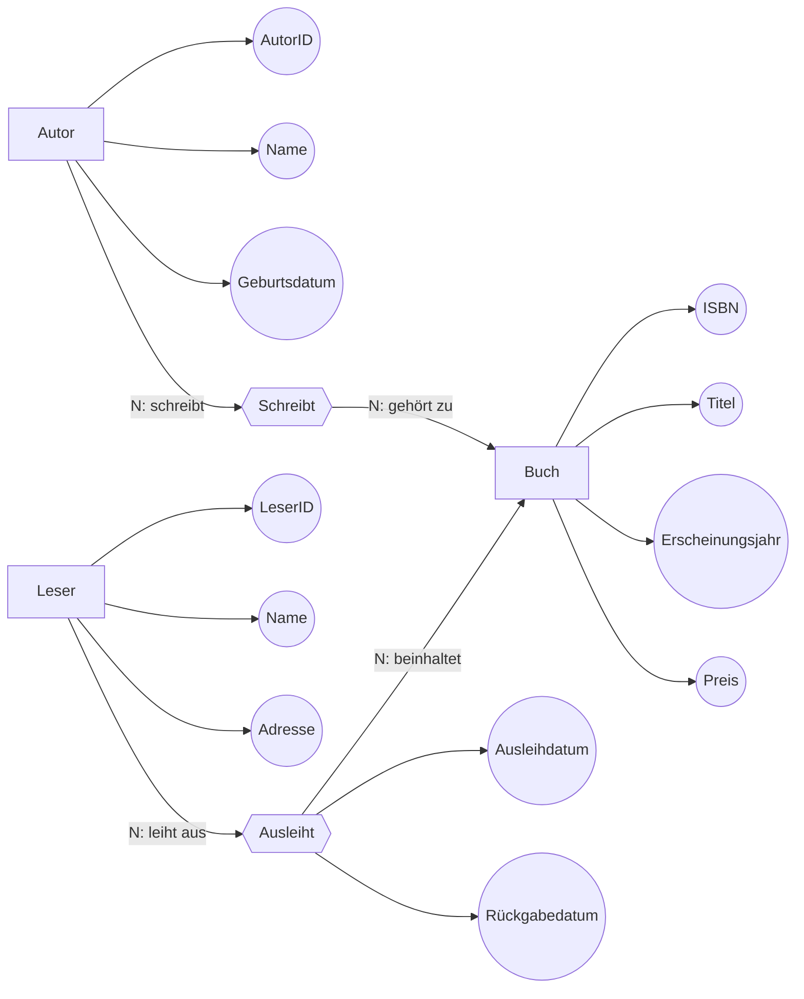

Dozent(_PersNr_,Name,Abteilung)
Student(MatrNr,Name,Geburtsdatum,Studienrichtung)
Kurs(_KursNr_,Name,Leistungspunkte,Dozent)
Belegt(_MatrNr_,_KursNr_)
Kategory(_KategNr_,KategName)
Prüfung(_PrüfungNr_,Name)
KursKategory(_KursNr_,_KategNr_)
KursPrüfung(_KursNr_,_PrüfungNr_)

Autor(_AutorID_,Name,Geburtsdatum)
Leser(_LeserID_,Name,Adresse)
Buch(_ISBN_,Titel,Erscheinungsjahr,Preis)
Schreibt(_AutorID_,_ISBN_)
Ausleiht(_LeserID_,_ISBN_,Ausleihdatum,Rückgabedatum)

**Übungsaufgabe: ER-Diagramm erstellen**

  

**Aufgabe**

  

Das Autohaus „SpeedCars“ benötigt eine Datenbank, um folgende Informationen zu verwalten. Formulieren Sie die Anforderungen als ER-Diagramm mit:

• **Entitäten** und deren **Attribute**,

• **Beziehungen** zwischen Entitäten,

• **Markierung der Schlüsselkandidaten**,

• **Kardinalitäten** zwischen den Entitäten.

  

Ergänzen Sie ggf. fehlende Angaben durch kommentierte Annahmen.

  

**Anforderungen**

1. Das Autohaus verkauft verschiedene Fahrzeuge (z. B. „Golf“, „Passat“, „Focus“, …).

• Jedes Fahrzeug hat eine eindeutige Fahrzeugnummer, eine Marke, ein Modell, eine Farbe und einen Preis.

2. Jedes Fahrzeug wird von genau einem Hersteller produziert, der durch seine HerstellerNr, seinen Namen und seinen Hauptsitz beschrieben wird.

3. Fahrzeuge gehören zu einer Fahrzeugkategorie (z. B. SUV, Limousine, Kombi, …).

• Jede Kategorie hat eine eindeutige KategoriewNr und eine Bezeichnung.

4. Kunden des Autohauses kaufen die Fahrzeuge.

• Jeder Kunde hat eine Kundennummer, einen Namen, eine Adresse und eine Telefonnummer.

5. Verkäufe werden von Verkäufern des Autohauses abgewickelt.

• Jeder Verkäufer hat eine Mitarbeiternummer, einen Nachnamen, einen Vornamen und eine Abteilung.

6. **Beziehungen**:

• Ein Kunde kann mehrere Fahrzeuge kaufen, aber ein Fahrzeug kann nur einmal verkauft werden.

• Jeder Verkauf wird von genau einem Verkäufer abgewickelt.

  

**Hinweise:**

1. Berücksichtigen Sie sinnvolle Kardinalitäten für die Beziehungen (z. B. 1:N, M:N).

2. Denken Sie an vollständige Attribute für alle Entitäten.

3. Geben Sie ggf. Annahmen an, z. B. welche Attribute unbedingt erforderlich sind oder welche Kardinalität für eine Beziehung sinnvoll ist.

  

**Punktevergabe (12 Punkte):**

• **4 Punkte**: Entitäten und Attribute (korrekt und vollständig).

• **4 Punkte**: Beziehungen zwischen Entitäten mit sinnvollen Kardinalitäten.

• **2 Punkte**: Markierung von Schlüsselkandidaten.

• **2 Punkte**: Ergänzung und Begründung fehlender Angaben (falls notwendig).

Stadt({Name,Breite , Länge }, liegt in)
Organisation({Name}, Gründung Daten ,beheimatet)
Land({Name}, Einwohner, Hauptstadt)
Organisationsmitglieder({Land,Organisation}, Status)
Angrenzung({Land1, Land2}, Länge)
