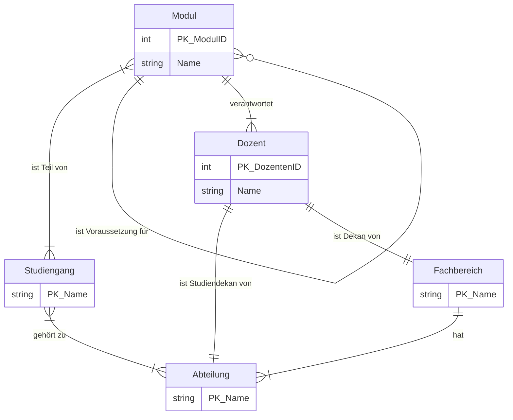

**Aufgabe 7.1**

  
Formulieren Sie folgenden Sachverhalt als ER-Modell:  

==Einem Fachbereich== sind immer ==mehrere Abteilungen zugeordnet==, wobei Fachbereich und Abteilung jeweils eindeutig durch einen ==Namen identifiziert== werden. ==Eine Abteilung== ist ==genau einem Fachbereich== zugeordnet. ==Eine Abteilung== bietet ==einen oder mehrere Studiengänge== an, wobei ==ein Studiengang== aber auch von ==mehreren Abteilungen zusammen angeboten werden kann==. ==Ein Studiengang== hat einen ==eindeutigen Namen== und besteht aus einer ==Menge von Modulen==. ==Ein Modul==, das ==einen Namen== und eine ==eindeutige ModulID== hat, kann aber auch in ==mehreren Studiengängen== und dort in ==unterschiedlichen Semestern== verwendet werden. ==Ein Modul== kann ==Voraussetzung für ein anderes Modul== sein. Für jedes Modul gibt es genau ==einen verantwortlichen Dozenten==, ==ein Dozent== kann dabei für ==mehrere Module== verantwortlich sein. ==Genau ein Dozent== ist ==Studiendekan== ==einer Abteilung== und ==genau ein Dozent== ist ==Dekan eines Fachbereichs==. ==Ein Dozent== wird durch ==seinen Namen== und seine ==DozentenID== beschrieben.

Zur Erstellung des ER-Modells können Sie z.B. [diagrams.net](https://www.diagrams.net/) verwenden.  

das neu machen
  

  

**Aufgabe 7.2**

Übersetzen Sie mit dem vorgestellten Verfahren das folgende **Entity-Relationship-Modell in Tabellen**.

```SQL
CREATE TABLE Projekt (
    Name VARCHAR(255) PRIMARY KEY,
    Leiter VARCHAR(255)
);

CREATE TABLE SW-Model (
    Name VARCHAR(255) PRIMARY KEY,  
    Obermodul VARCHAR(255), 
    FOREIGN KEY (Obermodul) REFERENCES SW_Modul(ModulName) 
);

CREATE TABLE Testfall (
    TestNr INT PRIMARY KEY,
    Ersteller VARCHAR(255),
    ProjektName VARCHAR(255),
    ModulName VARCHAR(255),
    Tester VARCHAR(255),
    Zeitpunkt DATETIME,
    Ergebnis VARCHAR(255),
    FOREIGN KEY (ProjektName) REFERENCES Projekt(ProjektName),
    FOREIGN KEY (ModulName) REFERENCES SW_Modul(ModulName)
);

```


**_Hinweis:_** Zu jedem Testfall soll in der Datenbank nur das Ergebnis der letzten Ausführung gespeichert werden (keine Historie).

_**Formatvorlage:**_ 

_Tabellenname: Attr1, Attr2,....Attrn_![[QmaxLyFsuXwdei7USaSmJkyCSnR9h6Qiya3vVQZKSZGwok.png]]