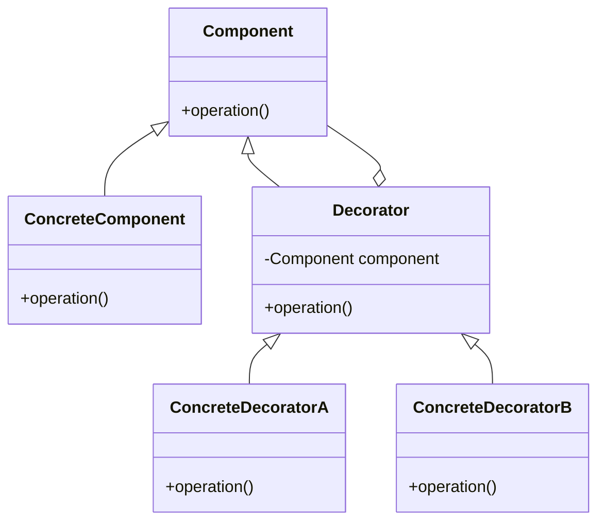

#Entwurfsmuster 
### Decorator (Dekorierer)

**Name**: Decorator

**Problembeschreibung**:
Es gibt Situationen, in denen die Funktionalität eines Objekts dynamisch zur Laufzeit erweitert oder verändert werden muss, ohne die Klasse des Objekts zu ändern.

**Lösungsbeschreibung**:
Das Decorator-Muster ermöglicht das dynamische Hinzufügen von Zuständigkeiten (Funktionalitäten) zu einem Objekt, indem es in spezielle Wrapper-Objekte eingebettet wird. Diese Wrapper-Objekte (Dekorierer) implementieren dieselbe Schnittstelle wie das ursprüngliche Objekt und delegieren Aufrufe an das ursprüngliche Objekt, während sie zusätzliche Funktionen hinzufügen.

**Konsequenzen**:
- Bietet eine flexible Alternative zur Unterklassenbildung, um Funktionalitäten zu erweitern.
- Ermöglicht die Kombination von Verhaltensweisen zur Laufzeit.
- Kann viele kleine Objekte erzeugen, die schwer zu debuggen und zu verwalten sind.

**[[Klassendiagramm]]**:


**Implementierung**:
- Definieren Sie eine `Component`-Schnittstelle mit einer Methode `operation()`.
- Implementieren Sie eine konkrete Komponente (`ConcreteComponent`), die diese Schnittstelle umsetzt.
- Implementieren Sie eine abstrakte Klasse `Decorator`, die ebenfalls die `Component`-Schnittstelle implementiert und eine Referenz auf ein `Component`-Objekt hält.
- Implementieren Sie konkrete Dekorierer (`ConcreteDecoratorA`, `ConcreteDecoratorB`), die die `Decorator`-Klasse erweitern und zusätzliche Funktionalitäten hinzufügen.

**Beispielcode in Java**:

```java
// Component Interface
interface Component {
    void operation();
}

// ConcreteComponent Class
class ConcreteComponent implements Component {
    @Override
    public void operation() {
        System.out.println("ConcreteComponent Operation");
    }
}

// Decorator Class
abstract class Decorator implements Component {
    protected Component component;

    public Decorator(Component component) {
        this.component = component;
    }

    @Override
    public void operation() {
        component.operation();
    }
}

// ConcreteDecoratorA Class
class ConcreteDecoratorA extends Decorator {
    public ConcreteDecoratorA(Component component) {
        super(component);
    }

    @Override
    public void operation() {
        super.operation();
        addedBehavior();
    }

    private void addedBehavior() {
        System.out.println("ConcreteDecoratorA Added Behavior");
    }
}

// ConcreteDecoratorB Class
class ConcreteDecoratorB extends Decorator {
    public ConcreteDecoratorB(Component component) {
        super(component);
    }

    @Override
    public void operation() {
        super.operation();
        addedBehavior();
    }

    private void addedBehavior() {
        System.out.println("ConcreteDecoratorB Added Behavior");
    }
}

// Client Code
public class DecoratorPatternDemo {
    public static void main(String[] args) {
        Component component = new ConcreteComponent();
        Component decoratorA = new ConcreteDecoratorA(component);
        Component decoratorB = new ConcreteDecoratorB(decoratorA);

        decoratorB.operation();  // Output: ConcreteComponent Operation
                                 //         ConcreteDecoratorA Added Behavior
                                 //         ConcreteDecoratorB Added Behavior
    }
}
```

**Zusammenfassung**:
- **Name**: Decorator
- **Problembeschreibung**: Dynamisches Hinzufügen von Zuständigkeiten zu einem Objekt zur Laufzeit.
- **Lösungsbeschreibung**: Verwendung von Wrapper-Objekten (Dekorierern), die die gleiche Schnittstelle wie das ursprüngliche Objekt implementieren und zusätzliche Funktionalitäten hinzufügen.
- **Konsequenzen**: Flexible Erweiterung von Funktionalitäten, aber potenziell viele kleine Objekte, die schwer zu verwalten sind.
- **Klassendiagramm**: Siehe oben.
- **Implementierung**: Definieren Sie eine `Component`-Schnittstelle, konkrete Komponenten und Dekorierer, die die Schnittstelle implementieren und zusätzliche Funktionalitäten hinzufügen.

Das Decorator-Muster ist besonders nützlich, wenn Sie die Funktionalität eines Objekts zur Laufzeit dynamisch ändern möchten, ohne die Klassenhierarchie zu ändern.