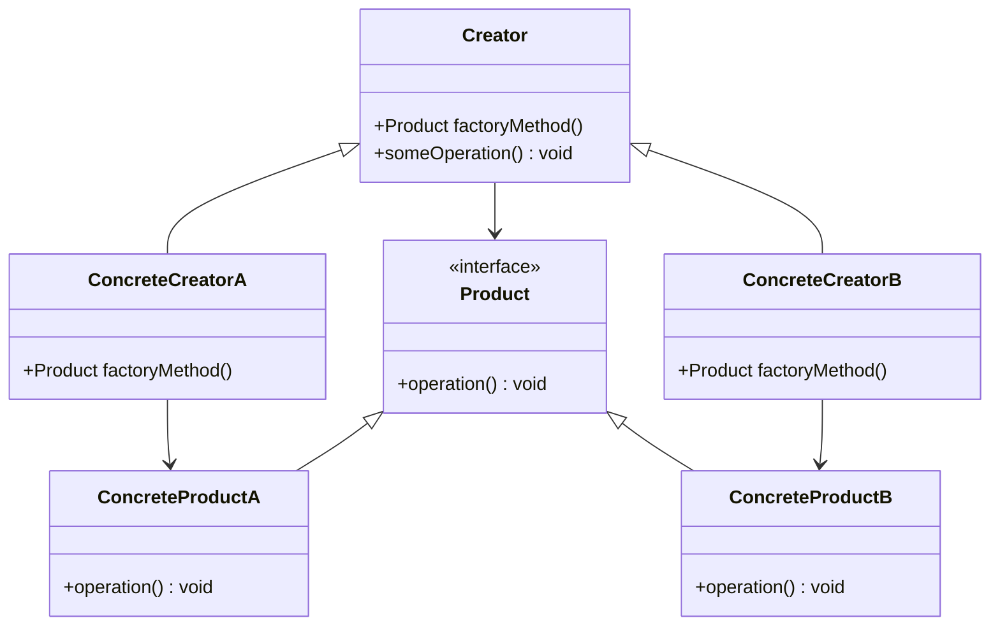

#Entwurfsmuster
#Erzeugungsmuster

### Factory Method

**Name**: Factory Method

**Kategorie**: Erzeugungsmuster

**Problembeschreibung**:
Eine Klasse kann ihre Unterklassen nicht instanziieren oder die genauen Klassen der Objekte, die sie erstellt, nicht kennen.

**Lösungsbeschreibung**:
Das Factory Method-Muster definiert eine Methode zur Erstellung von Objekten, lässt aber Unterklassen entscheiden, welche Klasse instanziiert wird. Dadurch wird die Entscheidung über die zu erstellende Klasse in die Unterklassen verlagert.

**Konsequenzen**:
- Erleichtert die Erstellung von Objekten und die Erweiterbarkeit von Code.
- Kann zu einer großen Anzahl von Klassen führen.

**Klassendiagramm**:


**Implementierung**:
1. Definieren Sie eine `Product`-Schnittstelle oder abstrakte Klasse.
2. Erstellen Sie konkrete Produkte, die die `Product`-Schnittstelle implementieren.
3. Definieren Sie eine abstrakte `Creator`-Klasse mit der `factoryMethod()`, die ein `Product`-Objekt zurückgibt.
4. Implementieren Sie konkrete `Creator`-Klassen, die die `factoryMethod()` überschreiben, um bestimmte `Product`-Objekte zu erstellen.

**Beispiel in Java**:
```java
// Product Interface
public interface Product {
    void operation();
}

// Concrete Products
public class ConcreteProductA implements Product {
    public void operation() {
        System.out.println("Using ConcreteProductA");
    }
}

public class ConcreteProductB implements Product {
    public void operation() {
        System.out.println("Using ConcreteProductB");
    }
}

// Creator Class
public abstract class Creator {
    public abstract Product factoryMethod();

    public void someOperation() {
        Product product = factoryMethod();
        product.operation();
    }
}

// Concrete Creators
public class ConcreteCreatorA extends Creator {
    public Product factoryMethod() {
        return new ConcreteProductA();
    }
}

public class ConcreteCreatorB extends Creator {
    public Product factoryMethod() {
        return new ConcreteProductB();
    }
}

// Client Code
public class FactoryMethodDemo {
    public static void main(String[] args) {
        Creator creatorA = new ConcreteCreatorA();
        creatorA.someOperation(); // Output: Using ConcreteProductA

        Creator creatorB = new ConcreteCreatorB();
        creatorB.someOperation(); // Output: Using ConcreteProductB
    }
}
```


Dieses Muster ist besonders nützlich, wenn eine Klasse die genaue Klasse der Objekte, die sie erstellen muss, nicht kennen kann und die Erstellung dieser Objekte den Unterklassen überlassen muss.