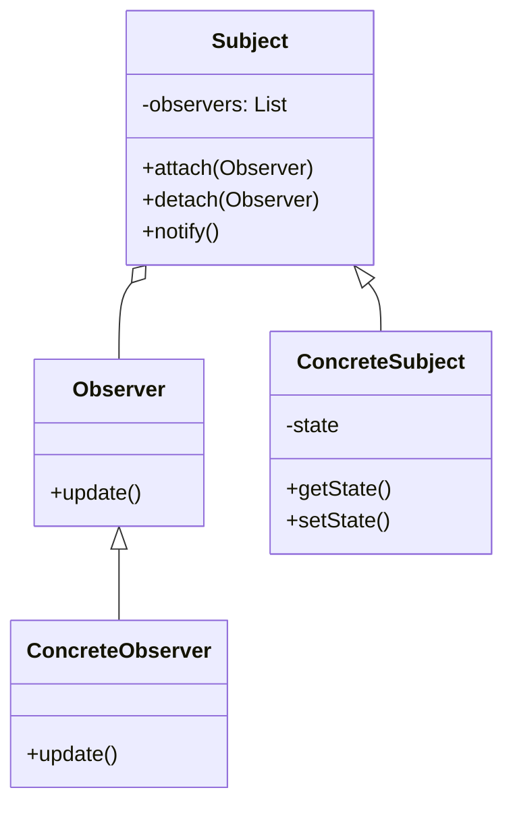

#Entwurfsmuster 
#Verhaltensmuster
**Name**: Observer

**Kategorie**: Verhaltensmuster

**Problembeschreibung**: Ein Objekt ändert seinen Zustand, und mehrere andere Objekte müssen über diese Änderung informiert werden.

**Lösungsbeschreibung**: Das Observer-Muster definiert eine Eins-zu-viele-Abhängigkeit zwischen Objekten, sodass, wenn ein Objekt seinen Zustand ändert, alle abhängigen Objekte benachrichtigt und automatisch aktualisiert werden.

**Konsequenzen**:

- Entkoppelt Subjekt und Beobachter.
- Unterstützt Broadcast-Kommunikation.
- Neue Beobachter können leicht hinzugefügt werden.

**[[Klassendiagramm]]**:

**Implementierung**:

1. Definieren Sie eine `Observer`-Schnittstelle mit einer Methode `update()`.
2. Implementieren Sie die `ConcreteObserver`-Klassen, die diese Schnittstelle implementieren und auf Benachrichtigungen reagieren.
3. Erstellen Sie eine `Subject`-Schnittstelle, die Methoden zum Anhängen, Abtrennen und Benachrichtigen von Beobachtern enthält.
4. Implementieren Sie eine `ConcreteSubject`-Klasse, die den Zustand speichert und die `Subject`-Schnittstelle implementiert.