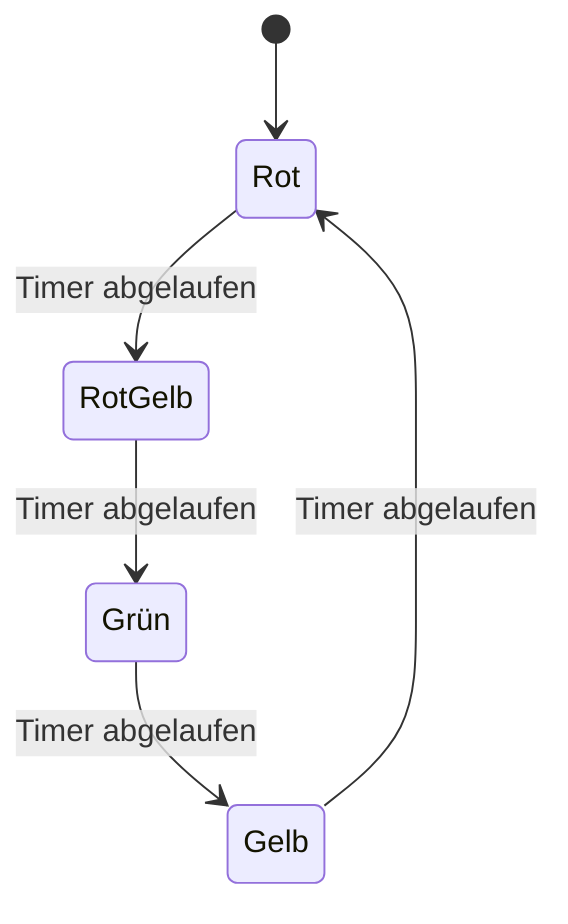
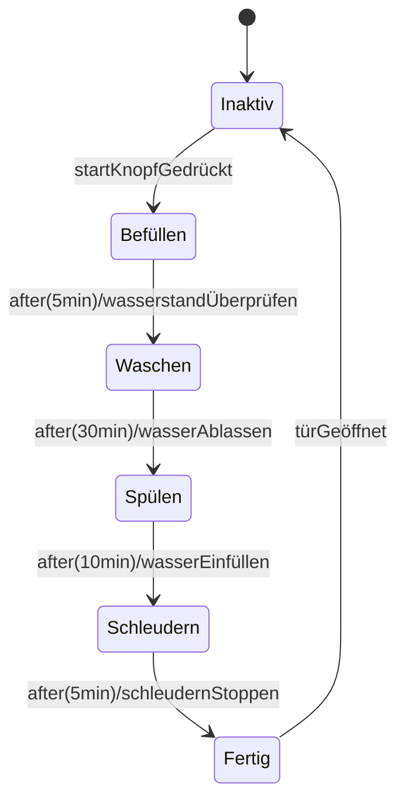
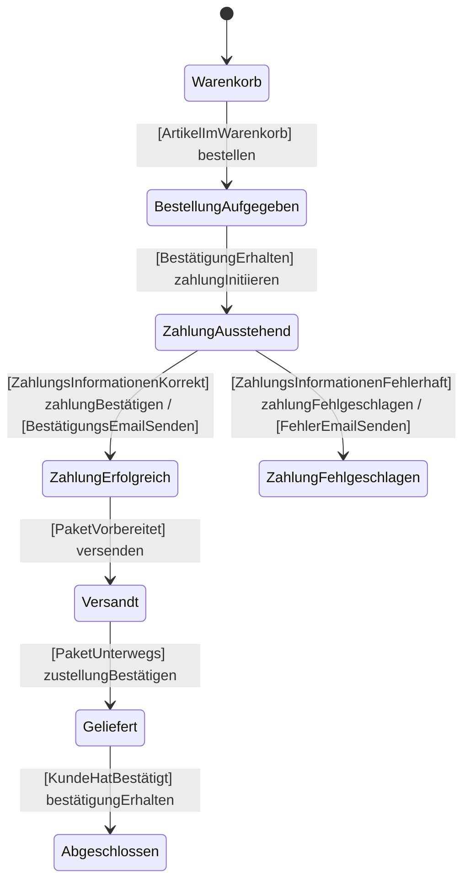
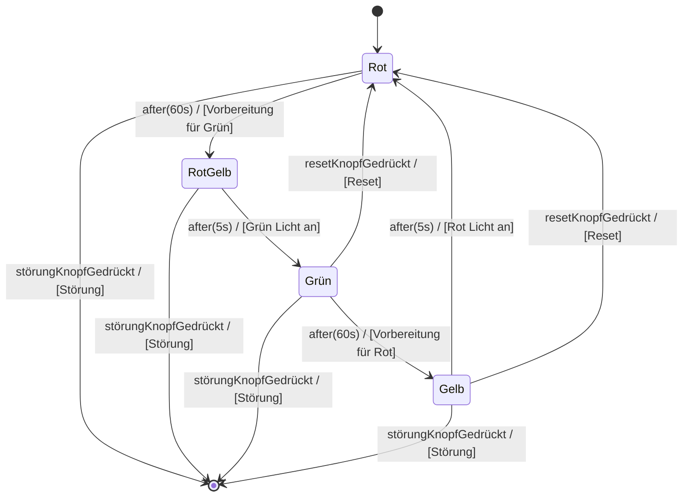

### Ampelschaltung



### Waschmaschinen




 ### Fahrkarte
 ```mermaid
 stateDiagram-v2
    [*] --> Bereit
    Bereit --> Auswahl : startKnopfGedrückt
    Auswahl --> ZahlungAusstehend : [TicketGewählt] zahlungInitiieren
    ZahlungAusstehend --> ZahlungErfolgreich : [BetragKorrekt] zahlungBestätigen / [TicketDrucken]
    ZahlungAusstehend --> ZahlungFehlgeschlagen : [BetragFehlerhaft] zahlungFehlgeschlagen / [FehlerMeldung]
    ZahlungErfolgreich --> TicketAusgabe : [TicketGedruckt] ticketAusgeben
    TicketAusgabe --> Abgeschlossen : [TicketEntnommen] abschließen

 ```

### Ampel

