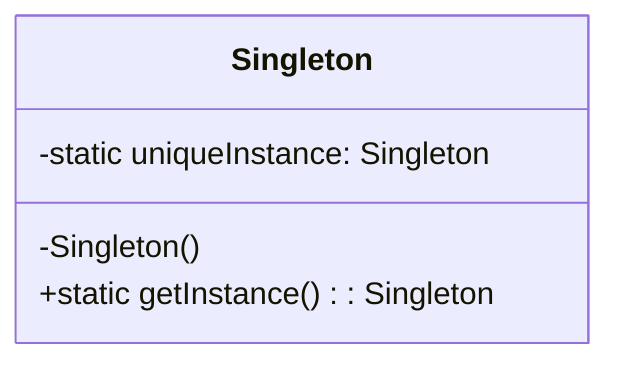

#Entwurfsmuster 

**Name**: Singleton

**Kategorie**: Erzeugungsmuster

**Problembeschreibung**: Es soll genau eine Instanz einer Klasse geben und diese Instanz soll global zugänglich sein.

**Lösungsbeschreibung**: Stellt sicher, dass eine Klasse nur eine Instanz hat und bietet einen globalen Zugriffspunkt auf diese Instanz.

**Konsequenzen**:

- Kontrollierter Zugriff auf die einzige Instanz.
- Möglichkeit zur Kontrolle der Anzahl von Instanzen.
- Kann zu Problemen beim Testen und Parallelität führen.

**[[Klassendiagramm]]**:

**Implementierung**:

1. Deklarieren Sie den Konstruktor als privat, um die Instanziierung zu verhindern.
2. Erstellen Sie eine statische Methode `getInstance()`, die die einzige Instanz der Klasse zurückgibt.

