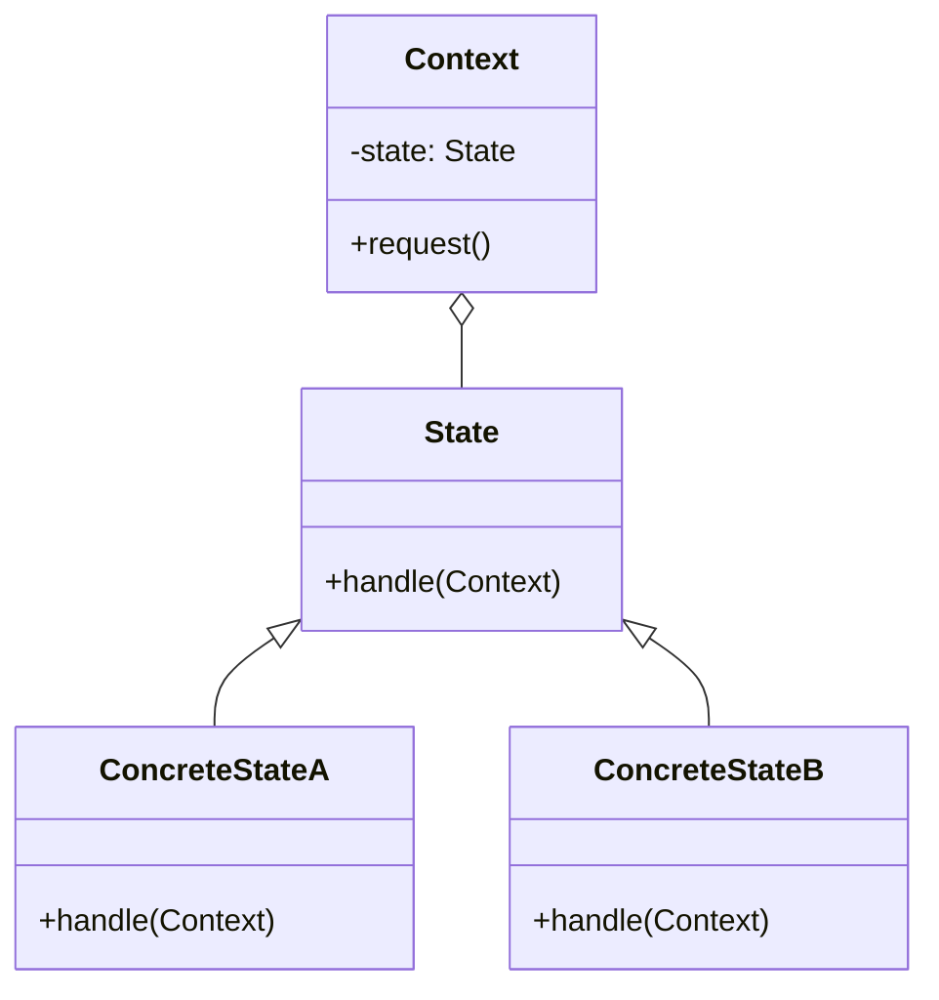

	#Entwurfsmuster 
### State (Zustand) Entwurfsmuster

**Name**: State

**Kategorie**: Verhaltensmuster

**Problembeschreibung**: Das Verhalten eines Objekts hängt von seinem Zustand ab und das Objekt muss sein Verhalten zur Laufzeit ändern können, abhängig von seinem aktuellen Zustand.

**Lösungsbeschreibung**: Das State-Muster kapselt zustandsspezifisches Verhalten in separaten Klassen und delegiert Zustandsänderungen an diese Klassen. Dadurch kann das Verhalten eines Objekts dynamisch geändert werden, ohne dass die Klasse des Objekts geändert wird.

**Konsequenzen**:

- Lokalisierung des zustandsabhängigen Verhaltens.
- Zustandsübergänge sind explizit und können leichter verwaltet werden.
- Zustandsobjekte können geteilt werden, wenn sie unveränderlich sind.

**[[Klassendiagramm]]**:

**Implementierung**:

1. Definieren Sie eine `State`-Schnittstelle mit einer Methode `handle(Context)`.
2. Erstellen Sie konkrete Zustandsklassen (`ConcreteStateA`, `ConcreteStateB`), die diese Schnittstelle implementieren und spezifisches Verhalten definieren.
3. Der `Context` hält eine Instanz eines `State`-Objekts und delegiert die Zustandsverarbeitung an dieses Objekt.