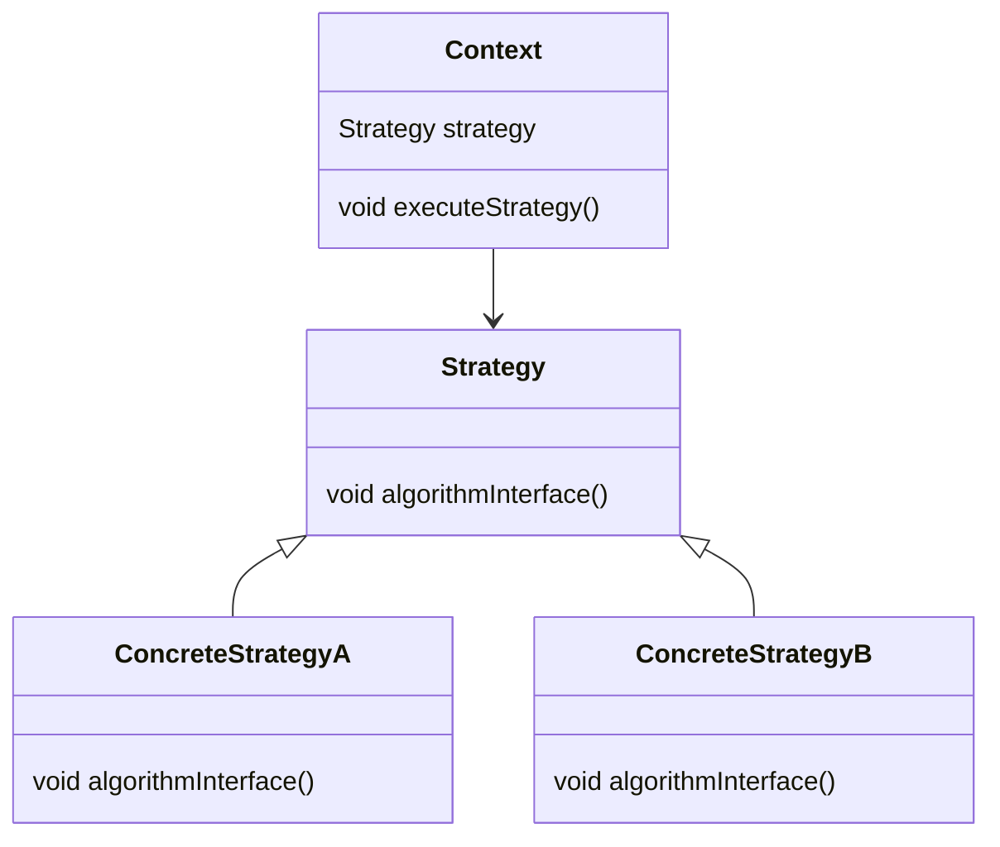

#Entwurfsmuster 
#### Strategy

**Name**: Strategy

**Problembeschreibung**:
Es gibt mehrere mögliche Algorithmen für eine Aufgabe, und der Algorithmus soll zur Laufzeit ausgewählt werden können.

**Lösungsbeschreibung**:
Das Strategy-Muster definiert eine Familie von Algorithmen, kapselt jeden einzelnen und macht sie untereinander austauschbar. Der Kontext verwendet eine Strategie, ohne deren Implementierung zu kennen.

**Konsequenzen**:
- Algorithmen können unabhängig voneinander variieren.
- Vermeidet bedingte Anweisungen.
- Kann zu einer großen Anzahl von Klassen führen.

**[[Klassendiagramm]]**:

**Implementierung**:
- Definieren Sie eine Strategy-Schnittstelle mit einer Methode für den Algorithmus.
- Implementieren Sie konkrete Strategien.
- Der Kontext enthält eine Referenz auf eine Strategy und verwendet diese zur Ausführung.

Diese Muster sind essenziell für die Entwicklung flexibler und erweiterbarer Software. Sie helfen dabei, bewährte Lösungen für häufig auftretende Probleme zu finden und die Wartbarkeit des Codes zu verbessern.